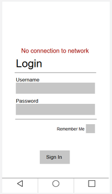
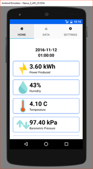

\linespread{2}

\setmainfont{Arial}

\fontsize{12}{14.4}

\selectfont

**Solar Panel Project**
=======================

From: Steven Spiteri, Richard Burak, and Salvatore Angilletta

Discipline: Computer Engineering Technology

Project Website: <https://steve-spiteri.github.io/>

Date of Submission: March 31st, 2017

\pagebreak

Declaration of Joint Authorship
===============================

Steven Spiteri, Richard Burak, and Salvatore Angilletta confirm that the
following work found in this technical report is a joint effort and is an
expression of our own ideas and research. All works cited are property of their
respective owners and are properly acknowledged using the APA format. Steven
Spiteri has developed the online web interface. Richard Burak has built the
MySQL database. Salvatore Angilletta was in charge of managing the Android
mobile application. Work on the hardware was distributed amongst the three of
us.

\pagebreak

Approved Proposal
=================

*Proposal for the development of a solar panel project*

Prepared by Steven Spiteri, Richard Burak, Salvatore Angilletta  
*Computer Engineering Technology Students*  
steve-spiteri.github.io

Executive Summary
-----------------

As student’s in the Computer Engineering Technology program, we will be
integrating the knowledge and skills we have learned from our program into this
Internet of Things themed capstone project. This proposal requests the approval
to build the hardware portion that will connect to a database as well as to a
mobile device application. The internet connected hardware will include a custom
PCB with various sensors. The database will store historical production and
weather data. The mobile device functionality will include the ability to view
the system status, DC output power overview, weather factors, past power
production data and will be further detailed in the mobile application proposal.
This semester I plan to continue working with Richard Burak and Salvatore
Angilletta, who also built similar hardware last term and have worked on the
mobile application. The hardware has been completed in CENG 317 Hardware
Production Techniques independently and the application has been completed in
CENG 319 Software Project. These will be integrated together this term in CENG
355 Computer Systems Project as a member of a 3 student group.

Background
----------

The problem solved by project is how to track a solar panel system. With the
purposed hardware and companion mobile application it will allow solar panel
owner the ability to easily monitor their system status, track their power
production, view historical production data, and view weather data from a web
interface and simple mobile application.

The hardware, powered by a Broadcom development platform, will operate in series
with a solar panel system. Information will be gathered to indicate if all is
well with the system and power production overview. Multiple sensors such as
temperature, humidity, barometric sensors will be used to gather weather data.
Weather data will be available to view at a glance and historically. With this
data you understand performance variations day to day.

I have searched for prior art via Humber’s IEEE subscription selecting “My
Subscribed Content” and have found and read three which provide insight into
similar efforts.

The first journal discusses how shade can reduce power generation up to 10-20%
annually.[@6892936]

The second journal discusses low cost options for measuring solar panel defects.
[@5762585]

The third and final journal we found provides information about how extreme high
temperature can affect solar panel degradation. [@7072567]

In the Computer Engineering Technology program we have learned about the
following topics from the respective relevant courses:

-   Java Docs from CENG 212 Programming Techniques In Java,

-   Construction of circuits from CENG 215 Digital And Interfacing Systems,

-   Rapid application development and Gantt charts from CENG 216 Intro to
    Software Engineering,

-   Micro computing from CENG 252 Embedded Systems,

-   SQL from CENG 254 Database With Java,

-   Web access of databases from CENG 256 Internet Scripting; and,

-   Wireless protocols such as 802.11 from TECH152 Telecom Networks.

This knowledge and skill set will enable me to build the subsystems and
integrate them together as my capstone project.

Methodology
-----------

This proposal is assigned in the first week of class and is due at the beginning
of class in the second week of the fall semester. My coursework will focus on
the first two of the 3 phases of this project:  
Phase 1 Hardware build.  
Phase 2 System integration.  
Phase 3 Demonstration to future employers.

*Phase 1 Hardware build*

The hardware build will be completed in the fall term. It will fit within the
CENG Project maximum dimensions of 12 13/16" x 6" x 2 7/8" (32.5cm x 15.25cm x
7.25cm) which represents the space below the tray in the parts kit. The highest
AC voltage that will be used is 16Vrms from a wall adaptor from which +/- 15V or
as high as 45 VDC can be obtained. Maximum power consumption will be 20 Watts.

*Phase 2 System integration*

The system integration has been completed in the winter term.

*Phase 3 Demonstration to future employers*

This project will showcase the knowledge and skills that I have learned to
potential employers.

The tables below provide rough effort and non-labour estimates respectively for
each phase. A Gantt chart will be added by week 3 to provide more project
schedule details and a more complete budget will be added by week 4. It is
important to start tasks as soon as possible to be able to meet deadlines.

| **Labour Estimates**                                                                      | **Hrs**        | **Notes**                                                                                                                                                                |
|-------------------------------------------------------------------------------------------|----------------|--------------------------------------------------------------------------------------------------------------------------------------------------------------------------|
| **Phase 1**                                                                               |                |                                                                                                                                                                          |
| Writing proposal.                                                                         | 9              | Tech identification quiz.                                                                                                                                                |
| Creating project schedule. Initial project team meeting.                                  | 9              | Proposal due.                                                                                                                                                            |
| Creating budget. Status Meeting.                                                          | 9              | Project Schedule due.                                                                                                                                                    |
| Acquiring components and writing progress report.                                         | 9              | Budget due.                                                                                                                                                              |
| Mechanical assembly and writing progress report. Status Meeting.                          | 9              | Progress Report due (components acquired milestone).                                                                                                                     |
| PCB fabrication.                                                                          | 9              | Progress Report due (Mechanical Assembly milestone).                                                                                                                     |
| Interface wiring, Placard design, Status Meeting.                                         | 9              | PCB Due (power up milestone).                                                                                                                                            |
| Preparing for demonstration.                                                              | 9              | Placard due.                                                                                                                                                             |
| Writing progress report and demonstrating project.                                        | 9              | Progress Report due. Demonstrations at Open House Saturday, November 12, 2016.                                                                                           |
| Editing build video.                                                                      | 9              | Peer grading of demonstrations due.                                                                                                                                      |
| Incorporation of feedback from demonstration and writing progress report. Status Meeting. | 9              | 30 second build video due.                                                                                                                                               |
| Practice presentations                                                                    | 9              | Progress Report due.                                                                                                                                                     |
| 1st round of Presentations, Collaborators present.                                        | 9              | Presentation PowerPoint file due.                                                                                                                                        |
| 2nd round of Presentations                                                                | 9              | Build instructions up due.                                                                                                                                               |
| Project videos, Status Meeting.                                                           | 9              | 30 second script due.                                                                                                                                                    |
| **Phase 1 Total**                                                                         | **135**        |                                                                                                                                                                          |
| **Phase 2**                                                                               |                |                                                                                                                                                                          |
| Meet with collaborators                                                                   | 9              | Status Meeting                                                                                                                                                           |
| Initial integration.                                                                      | 9              | Progress Report                                                                                                                                                          |
| Meet with collaborators                                                                   | 9              | Status Meeting                                                                                                                                                           |
| Testing.                                                                                  | 9              | Progress Report                                                                                                                                                          |
| Meet with collaborators                                                                   | 9              | Status Meeting                                                                                                                                                           |
| Meet with collaborators                                                                   | 9              | Status Meeting                                                                                                                                                           |
| Incorporation of feedback.                                                                | 9              | Progress Report                                                                                                                                                          |
| Meet with collaborators                                                                   | 9              | Status Meeting                                                                                                                                                           |
| Testing.                                                                                  | 9              | Progress Report                                                                                                                                                          |
| Meet with collaborators                                                                   | 9              | Status Meeting                                                                                                                                                           |
| Prepare for demonstration.                                                                | 9              | Progress Report                                                                                                                                                          |
| Complete presentation.                                                                    | 9              | Demonstration at Open House Saturday, April 8, 2017.                                                                                                                     |
| Complete final report. 1st round of Presentations.                                        | 9              | Presentation PowerPoint file due.                                                                                                                                        |
| Write video script. 2nd round of Presentations, delivery of project.                      | 9              | Final written report including final budget and record of expenditures, covering both this semester and the previous semester.                                           |
| Project videos.                                                                           | 9              | Video script due                                                                                                                                                         |
| **Phase 2 Total**                                                                         | **135**        |                                                                                                                                                                          |
| **Phase 3**                                                                               |                |                                                                                                                                                                          |
| Interviews                                                                                | TBD            |                                                                                                                                                                          |
| **Phase 3 Total**                                                                         | **TBD**        |                                                                                                                                                                          |
| **Material Estimates**                                                                    | **Cost**       | **Notes**                                                                                                                                                                |
| **Phase 1**                                                                               |                |                                                                                                                                                                          |
| Raspberry Pi 3 Kit                                                                        | \$119.99       | [CanaKit](https://www.amazon.ca/CanaKit-Raspberry-Ultimate-Starter-Kit/dp/B01CCF9BYG/ref=sr_1_3?ie=UTF8&qid=1474395691&sr=8-3&keywords=raspberry+pi)                     |
| Barmetric Pressure Sensor                                                                 | \$8.33         | [RobotShop](http://www.robotshop.com/ca/en/octopus-barometric-pressure-sensor-brick.html)                                                                                |
| DHT-11 Sensor Breakout                                                                    | \$4.04         | [RobotShop](http://www.robotshop.com/ca/en/electronic-brick-humidity-temperature-sensor.html)                                                                            |
| 6V Solar Cell                                                                             | \$5.95         | [Sayal](http://www.sayal.com/STORE/View_SPEC.asp?SKU=237344)                                                                                                             |
| Safety Glasses                                                                            | \$5.04         | [Pyramex](https://www.amazon.ca/Pyramex-Mini-S2510SN-Safety-Glasses/dp/B000NP5D3G/ref=sr_1_4?ie=UTF8&qid=1480724554&sr=8-4&keywords=safety+glasse)                       |
| Lead Free Solder (10g)                                                                    | \$4.49         | [RobotShop](http://www.robotshop.com/ca/en/lead-free-solder-wire-10g-tube.html)                                                                                          |
| Soldering Iron (25W)                                                                      | \$6.80         | [RobotShop](http://www.robotshop.com/ca/en/elenco-sr-1-standard-25w-pencil-soldering-iron.html)                                                                          |
| Soldering Iron Holder                                                                     | \$4.56         | [RobotShop](http://www.robotshop.com/ca/en/elenco-soldering-iron-holder.html)                                                                                            |
| 5-pin PCB Header (female)                                                                 | \$0.89         | [Digi-Key](http://www.digikey.ca/product-detail/en/sullins-connector-solutions/PPTC051LFBN-RC/S6103-ND/807239)                                                           |
| 2x20 GPIO Header                                                                          | \$9.99         | [Adafruit](https://www.amazon.ca/GPIO-Stacking-Header-Pi-Extra-long/dp/B00TW0W9HQ/ref=sr_1_2?ie=UTF8&qid=1480734825&sr=8-2&keywords=gpio+header)                         |
| Humber PCB Components Kit                                                                 | \~\$40.00      | [Humber College - Prototype Lab](http://humber.zone/)                                                                                                                    |
| Custom PCB                                                                                | **TBD**        | [Humber College - Prototype Lab](http://humber.zone/)                                                                                                                    |
| Laser-cut Acrylic Box                                                                     | \~\$30.00**​**  | [Humber College - Prototype Lab](http://humber.zone/)                                                                                                                    |
| Digital Multimeter                                                                        | \$14.59        | [RobotShop](http://www.robotshop.com/ca/en/m-1000e-compact-digital-multimeter.html)                                                                                      |
| M2.5 Screws/Standoffs                                                                     | \$11.99 (Bulk) | [HVAZI](https://www.amazon.com/HVAZI-Standoff-Stainless-Assortment-Male-Female/dp/B01L06CUJG/ref=sr_1_5?s=industrial&ie=UTF8&qid=1480722221&sr=1-5&keywords=m2.5+screws) |
| **Phase 1 Total**                                                                         | **\$​267.43**   |                                                                                                                                                                          |
| **Phase 2**                                                                               |                |                                                                                                                                                                          |
| Laser-cut Acrylic Top of Box                                                              | **TBD**        | [Humber College - Prototype Lab](http://humber.zone/)                                                                                                                    |
| **Phase 2 Total**                                                                         | **TBD**        |                                                                                                                                                                          |
| **Phase 3**                                                                               |                |                                                                                                                                                                          |
| Off campus colocation                                                                     | *TBD*          |                                                                                                                                                                          |
| *Shipping*                                                                                | *TBD*          |                                                                                                                                                                          |
| *Tax*                                                                                     | *TBD*          |                                                                                                                                                                          |
| *Duty*                                                                                    | *TBD*          |                                                                                                                                                                          |
| **Phase 3 Total**                                                                         | **TBD**        |                                                                                                                                                                          |

Concluding remarks
------------------

This proposal presents a plan for providing an IoT solution for the difficulty
accessing solar panel data. This is an opportunity to integrate the knowledge
and skills developed in our program to create a collaborative IoT capstone
project. I request approval of this project.

\pagebreak

Abstract
========

Home owners, who posses solar power generation systems, have difficulty easily
accessing power production information and determining the effect of
environmental elements. To address this, a product must be created to assist in
the monitoring and collection of data to clearly determine power production and
its relationship with weather factors. This product monitors solar cell voltage
generation, surrounding temperature, light levels, barometric pressure, and
humidity. Data retrieved from the sensors is processed on the Broadcom
development platform before being sent to a co-located database. Each entry in
the database has a date and time associated with it to provide context. The
database stores the sensor data and is accessed by both the Android mobile
application and the online web interface. The Android mobile application
displays the data in an easy-to-read manner for the end user with the option to
view it in a graph. The online web interface provides the same functionality
with a more interactive approach. This product has the potential to enhance
solar panel ownership and research by allowing users to intuitively manage their
solar power generation system.

\pagebreak

Illustrations/Diagrams
======================

Figure 1: Modular Sensor Hat Board

Figure 2: Modular Sensor Hat Schematic

Figure 3: Supplementary Board

Figure 4: User Login

Figure 5: Incorrect Login

Figure 6: No network connection

Figure 7: Live data on home screen

Figure 8: Database view

Figure 9: Settings for the app

\pagebreak

Table of Contents
=================

Approved Proposal

\quad Executive Summary

\quad Background

\quad Methodology

\quad Concluding Remarks

Abstract

Illustrations/Diagrams

[1.] Introduction

[2.] Project Description

\quad [2.1] Software Requirements Specifications

\quad \quad [2.1.1] Product Introduction

\quad \quad \quad [2.1.1.1] Purpose

\quad \quad \quad [2.1.1.2] Intended Audience

\quad \quad \quad [2.1.1.3] Product Scope

\quad \quad [2.1.2] Overall Description

\quad \quad \quad [2.1.2.1] Product Perspective

\quad \quad \quad [2.1.2.2] Product Functions

\quad \quad \quad [2.1.2.3] User Classes and Characteristics

\quad \quad \quad [2.1.2.4] Operating Environment

\quad \quad \quad [2.1.2.5] User Documentation

\quad \quad [2.1.3] External Interface Requirements

\quad \quad \quad [2.1.3.1] Database

\quad \quad \quad [2.1.3.2] Mobile Application

\quad \quad \quad [2.1.3.3] Online Web Interface

\quad \quad \quad [2.1.3.4] Additional Hardware

\quad \quad [2.1.4] Other Non-Functional Requirements

\quad \quad \quad [2.1.4.1] Safety Requirements

\quad \quad \quad [2.1.4.2] Security Requirements

[3.] Hardware Build Instructions

\quad [3.1] Build Introduction

\quad [3.2] Basic System Overview

\quad [3.3] Budget and Materials

\quad [3.4] Time Commitment

\quad [3.5] Development Platform Setup

\quad [3.6] PCB Soldering/Testing

\quad [3.7] Unit Testing Sensors

\quad [3.8] Connecting the Circuit

\quad [3.9] Box Creation and Final Assembly

\quad [3.10] Build Conclusion

[4.] Software Implementation Instructions

\quad [4.1] Mobile Application Setup

\quad [4.2] Database and Web Setup

[5.] Mobile Application Documents

\quad [5.1] Approved Software Proposal

\quad [5.2] Design Document

\quad \quad [5.2.1] Introduction

\quad \quad \quad [5.2.1.1] Purpose

\quad \quad \quad [5.2.1.2] Scope

\quad \quad \quad [5.2.1.3] Intended Audience

\quad \quad [5.2.2] Design Overview

\quad \quad \quad [5.2.2.1] The Problem

\quad \quad \quad [5.2.2.2] Technology Used

\quad \quad \quad [5.2.2.3] Requirements Analysis

\quad \quad \quad [5.2.2.4] User Login

\quad \quad \quad [5.2.2.5] Database Access

\quad \quad \quad [5.2.2.6] Data Manipulation

\quad \quad [5.2.3] Design Mock-ups

\quad \quad \quad [5.2.3.1] Initial Login

\quad \quad \quad [5.2.3.2] Initial Login (Bad Credentials)

\quad \quad \quad [5.2.3.3] Initial Login (No Connection)

\quad \quad \quad [5.2.3.4] Home Screen

\quad \quad \quad [5.2.3.6] Database Screen

\quad \quad \quad [5.2.3.7] Settings Screen

\quad [5.3] Work Breakdown

[6.] Schedule/Progress Reports

\quad [6.1] Schedule

\quad [6.2] Progress Reports

\quad \quad [6.2.1] Progress Report 4/10/2016

\quad \quad [6.2.2] Progress Report 11/10/2016

\quad \quad [6.2.3] Progress Report 8/11/2016

\quad \quad [6.2.4] Progress Report 11/11/2016

\quad \quad [6.2.5] Progress Report 15/11/2016

\quad \quad [6.2.6] Progress Report 22/11/2016

\quad \quad [6.2.7] Progress Report 12/12/2016

\quad \quad [6.2.8] Progress Report 3/2/2017

\quad \quad [6.2.9] Progress Report 16/2/2017

\quad \quad [6.2.10] Progress Report 10/3/2017

\quad \quad [6.2.11] Progress Report 24/3/2017

[7.] Conclusion

[8.] Bibliography

 

\pagebreak

[1.] Introduction
=================

In the current marketplace home owners, who posses solar power generation
systems, have difficulty easily accessing power production information and
determining the effect of environmental elements. Home owners have adopted a
relatively new technology and should be confident in knowing that information
regarding it is always available. Since this product automates the collection
and distribution of the data, the responsibility of the home owner is minimized.

With this product it will grant solar panel owners the ability to easily monitor
their system status, track their power production, view historical production
data, and view weather data from an interactive display and simple mobile
application.

The hardware, powered by a Broadcom development platform, will operate in series
with a solar panel system. Information will be gathered to indicate if all is
well with the system and power production overview. Multiple sensors such as
light, temperature, humidity, barometric pressure sensors will be used to gather
weather data. Weather data will be available to view at a glance and
historically.

This product uses an off-site database which can be accessed through both the
online web interface and Android mobile application. This will allow the end
user to monitor their solar panel power generation system from a remote
location.

A goal when creating this product was to follow a tight budget so the cost of
building it has remained relatively low. The price for consumers should remain
low and researchers will have a low-cost monitoring solution.

Following AGPLv3, all of our source code will be made available online for
public viewing. This is due to the Android application using GraphView and our
firmware using Adafruit Python libraries.

\pagebreak

[2.] Product Description
========================

[2.1] Software Requirements Specifications
------------------------------------------

### [2.1.1] Product Introduction

### [2.1.1.1] Purpose

This product is to be used in tandem with a solar power generation system. It is
meant to enhance solar panel ownership by providing an intuitive way of
gathering and examining data for both home owners and researchers.

### [2.1.1.2] Intended Audience

This document is intended for industry professionals and educational
institutions for research and evaluation.

### [2.1.1.3] Product Scope

The product is built using a Broadcom development platform to interface with a
solar cell and a variety of sensors. All of the data is gathered using these
on-board sensors, which collect information about the humidity, temperature,
barometric pressure, and light level around the hardware. Because the power
generation of the solar cell is also tracked, it can be correlated with the
weather data and used to further our research into solar energy.

### [2.1.2] Overall Description

### [2.1.2.1] Product Perspective

This product is aimed to be a new way to gather and display data from any
existing solar power generation system.

### [2.1.2.2] Product Functions

The various sensors are tasked with gathering the raw data. The DHT-11 is used
for humidity, the BMP085 for barometric pressure and temperature, the YL-40 for
light-levels, and finally a solar cell may be connected and have its voltage
generation measured. The development platform contains software to convert this
raw data into readable values. These values are then uploaded to a remote
database for future access. This database can be read using either the Android
application or the online web interface.

### [2.1.2.3] User Classes and Characteristics

The expected user of this product is any homeowner with a private solar power
generation system. The software interface is geared towards being simple and
accessible for casual smartphone users. A secondary user base can include
researchers looking to further work in solar panel technology.

### [2.1.2.4] Operating Environment

The mobile application must run on Android API 19 and above, on either a
smartphone or tablet device. The software running on the development platform is
designed to work with a Linux-based operating system. Finally, the database uses
MySQL and is accessed with PHP scripts.

### [2.1.2.5] User Documentation

Users will have access to hardware build instructions that provide a
step-by-step guide for putting the product together. Instructions for the Linux
software configuration are included as part of the build instructions.

### [2.1.3] External Interface Requirements

### [2.1.3.1] Database

The MySQL database will run on a co-located free-hosting website. The database
will use phpMyAdmin to for administrative interaction on the front-end. The
information contained includes formatted data downloaded from the development
platform. There are two tables, one with a username and password for the Android
app users, and on with entries for all the weather data collected (power,
temperature, light, barometric pressure, humidity, and time). The database will
be populated by data downloaded from the hardware.

(Developed by Richard Burak)

### [2.1.3.2] Mobile Application

The mobile application, available on Android platforms, will take the data from
the MySQL database and temporarily store it on the target device in memory. It
will display the data in an easy-to-read manner for the end user. There is the
option to view the data in a graph. The user can customize to see a different
range of historical data. The application has a total of three activities:
login, main and a settings. The login activity allows the user to log into an
account and have access to their data. The main activity has two areas; The main
area contains the user’s homepage and the other contains the graph. The settings
activity allows the user to change the temperature notation from Celsius to
Fahrenheit.

(Developed by Salvatore Angilletta)

### [2.1.3.3] Online Web Interface

An online web interface will be developed and mirror the functionality of the
mobile application. After the user logs in they will have access to their data
in an easy-to-read manner. On a single page, the web interface will contain the
users most recent data and a table containing historical data. An option may be
available for the user to change the temperature notation from Celsius to
Fahrenheit.

(Developed by Steven Spiteri)

### [2.1.3.4] Additional Hardware

A new top for the product casing will be laser cut to allow mounting of the
solar cell and allow routing for the solar cell connection.

(Developed by Steven Spiteri, Richard Burak, and Salvatore Angilletta)

### [2.1.4] Other Non-Functional Requirements

### [2.1.4.1] Safety Requirements

-   This product shall only be connected to an external power supply rated at 5
    Volts DC.

-   This product is intended to accompany solar power generation systems,
    therefore requires a trained professional when dealing with high voltage
    equipment.

-   To avoid malfunction or damage do not expose it to water, moisture or place
    on a conductive surface whilst in operation.

-   Do not use this product for anything outside it’s intended purpose.

### [2.1.4.2] Security Requirements

-   Do not share your identity authentication and password.

-   Keep software up-to-date to ensure proper operation.

\pagebreak

[3.] Hardware Build Instructions
================================

[3.1] Build Introduction
------------------------

This section contains all the knowledge necessary in order to reproduce the
solar panel project. An individual should be able to recreate this product by
following these instructions. Before continuing with this section, be sure to
remember all proper safety procedures when interacting with computer hardware
and electrical components.

[3.2] Basic System Overview
---------------------------

The system will require the input from the sensors, which will receive their
input from the physical environment surrounding them. The data must then be
processed and converted to values that are readable and relevant. Once these
number values are obtained, they will be displayed on demand, or whenever a user
requests it.

[3.3] Budget and Materials
--------------------------

| **Material Estimates**    | **Cost**       | **Notes**                                                                                                                                                                |
|---------------------------|----------------|--------------------------------------------------------------------------------------------------------------------------------------------------------------------------|
| Raspberry Pi 3 Kit        | \$119.99       | [CanaKit](https://www.amazon.ca/CanaKit-Raspberry-Ultimate-Starter-Kit/dp/B01CCF9BYG/ref=sr_1_3?ie=UTF8&qid=1474395691&sr=8-3&keywords=raspberry+pi)                     |
| Barmetric Pressure Sensor | \$8.33         | [RobotShop](http://www.robotshop.com/ca/en/octopus-barometric-pressure-sensor-brick.html)                                                                                |
| DHT-11 Sensor Breakout    | \$4.04         | [RobotShop](http://www.robotshop.com/ca/en/electronic-brick-humidity-temperature-sensor.html)                                                                            |
| 6V Solar Cell             | \$5.95         | [Sayal](http://www.sayal.com/STORE/View_SPEC.asp?SKU=237344)                                                                                                             |
| Safety Glasses            | \$5.04         | [Pyramex](https://www.amazon.ca/Pyramex-Mini-S2510SN-Safety-Glasses/dp/B000NP5D3G/ref=sr_1_4?ie=UTF8&qid=1480724554&sr=8-4&keywords=safety+glasse)                       |
| Lead Free Solder (10g)    | \$4.49         | [RobotShop](http://www.robotshop.com/ca/en/lead-free-solder-wire-10g-tube.html)                                                                                          |
| Soldering Iron (25W)      | \$6.80         | [RobotShop](http://www.robotshop.com/ca/en/elenco-sr-1-standard-25w-pencil-soldering-iron.html)                                                                          |
| Soldering Iron Holder     | \$4.56         | [RobotShop](http://www.robotshop.com/ca/en/elenco-soldering-iron-holder.html)                                                                                            |
| 5-pin PCB Header (female) | \$0.89         | [Digi-Key](http://www.digikey.ca/product-detail/en/sullins-connector-solutions/PPTC051LFBN-RC/S6103-ND/807239)                                                           |
| 2x20 GPIO Header          | \$9.99         | [Adafruit](https://www.amazon.ca/GPIO-Stacking-Header-Pi-Extra-long/dp/B00TW0W9HQ/ref=sr_1_2?ie=UTF8&qid=1480734825&sr=8-2&keywords=gpio+header)                         |
| Humber PCB Components Kit | \~\$40.00      | [Humber College - Prototype Lab](http://humber.zone/)                                                                                                                    |
| Custom PCB                | **TBD**        | [Humber College - Prototype Lab](http://humber.zone/)                                                                                                                    |
| Laser-cut Acrylic Box     | \~\$30.00**​**  | [Humber College - Prototype Lab or Hot Pop Factory](http://www.hotpopfactory.com/http://humber.zone/)                                                                    |
| Digital Multimeter        | \$14.59        | [RobotShop](http://www.robotshop.com/ca/en/m-1000e-compact-digital-multimeter.html)                                                                                      |
| M2.5 Screws/Standoffs     | \$11.99 (Bulk) | [HVAZI](https://www.amazon.com/HVAZI-Standoff-Stainless-Assortment-Male-Female/dp/B01L06CUJG/ref=sr_1_5?s=industrial&ie=UTF8&qid=1480722221&sr=1-5&keywords=m2.5+screws) |

[3.4] Time Commitment
---------------------

| **Task**                   | **Time Required (Approx.)** |
|----------------------------|-----------------------------|
| Ordering Parts             | 1 hour                      |
| Parts Delivery             | 2 weeks                     |
| Development Platform Setup | 2 hours                     |
| Printing PCBs              | 20 minutes                  |
| Soldering PCBs             | 3 hours                     |
| Testing PCBs               | 30 minutes                  |
| Unit Testing Sensors       | 2 hours                     |
| Connecting Circuits        | 10 minutes                  |
| Laser-cutting Box          | 10 minutes                  |
| Box Assembly               | 1 hour (24 hours to dry)    |
| Mount project in box       | 5 minutes                   |

[3.5] Development Platform Setup
--------------------------------

Once the Broadcom development platform has been acquired, begin by connecting it
to a display. Next, connect the keyboard and mouse. You can now plug the
development platform into power and begin configuring the operating system. The
setup will be explained on screen, and you may begin using the development
platform once it has completed. In the top right-hand corner of the screen,
select the network you want the development platform to automatically connect to
when it boots up (skip this step if the device is using a wired connection). Be
sure to make note of the IP address, as it may be required later if remotely
connecting to the device. The IP can be found by hovering the mouse over the
WiFi symbol on the top-right. Once connected to the internet, open the command
line terminal and run the following command:

~~~~~~~~~~~~~~~~~~~~~~~~~~~~~~~~~~~~~~~~~~~~~~~~~~~~~~~~~~~~~~~~~~~~~~~~~~~~~~~~
sudo apt-get update
~~~~~~~~~~~~~~~~~~~~~~~~~~~~~~~~~~~~~~~~~~~~~~~~~~~~~~~~~~~~~~~~~~~~~~~~~~~~~~~~

This will update the development platform to the most recent version. This is
important, as security updates are required to keep the device safe. Next, SSH
must be enabled by default, otherwise you will not be able to remotely access
the development platform. To ensure SSH starts when the development platform is
booted up, run this in the command line:

~~~~~~~~~~~~~~~~~~~~~~~~~~~~~~~~~~~~~~~~~~~~~~~~~~~~~~~~~~~~~~~~~~~~~~~~~~~~~~~~
mv /boot/boot_enable_ssh.rc /boot/boot.rc
~~~~~~~~~~~~~~~~~~~~~~~~~~~~~~~~~~~~~~~~~~~~~~~~~~~~~~~~~~~~~~~~~~~~~~~~~~~~~~~~

Now that SSH is enabled, VNC must be installed and enabled. VNC allows users to
navigate the GUI of the development platform remotely. To install this, run the
following commands:

~~~~~~~~~~~~~~~~~~~~~~~~~~~~~~~~~~~~~~~~~~~~~~~~~~~~~~~~~~~~~~~~~~~~~~~~~~~~~~~~
sudo install tightvncserver tightvncserver
~~~~~~~~~~~~~~~~~~~~~~~~~~~~~~~~~~~~~~~~~~~~~~~~~~~~~~~~~~~~~~~~~~~~~~~~~~~~~~~~

Setup a password for VNC when asked. You will now be able to run VNC server by
accessing the development platform through SSH, then interface using any VNC
client. To prepare the development platform for use with the sensors, I2C must
be enabled. To do this, start by running the following command:

~~~~~~~~~~~~~~~~~~~~~~~~~~~~~~~~~~~~~~~~~~~~~~~~~~~~~~~~~~~~~~~~~~~~~~~~~~~~~~~~
sudo raspi-config
~~~~~~~~~~~~~~~~~~~~~~~~~~~~~~~~~~~~~~~~~~~~~~~~~~~~~~~~~~~~~~~~~~~~~~~~~~~~~~~~

Use the arrow keys to navigate to advanced options and hit enter. Once there,
navigate to I2C and hit enter again. Select "Yes" to have I2C enabled on the
development platform. Next, we must prepare the Python program used to interface
with the sensors. The program below (solar.py) will show the data gathered by
the sensors in the circuit. It will not successfully run until all the sensors
have been tested and connected. Simply place the file in any directory on the
development platform.

(https://raw.githubusercontent.com/steve-spiteri/steve-spiteri.github.io/master/solar.py)

~~~~~~~~~~~~~~~~~~~~~~~~~~~~~~~~~~~~~~~~~~~~~~~~~~~~~~~~~~~~~~~~~~~~~~~~~~~~~~~~
#!/usr/bin/python

import Adafruit_BMP.BMP085 as BMP085
import Adafruit_DHT
import RPi.GPIO as GPIO
import time
import smbus
import sys
import requests

GPIO.VERSION
GPIO.setmode(GPIO.BOARD)
GPIO.setwarnings(False)
GPIO.setup(11, GPIO.OUT)
GPIO.setup(12,GPIO.OUT)

try:
    while True:
        sensor = BMP085.BMP085()
        bus = smbus.SMBus(1)

        humidity, temperature = Adafruit_DHT.read_retry(11, 4)
        # Un-comment the line below to convert the temperature to Fahrenheit.
        # temperature = temperature * 9/5.0 + 32
        temp = sensor.read_temperature()
        pressure = sensor.read_pressure()
        altitude = sensor.read_altitude()
        power = bus.read_byte(0x48)/50
        light = bus.read_byte(0x48)
        time_date = str(time.strftime("%d/%m/%Y %H:%M:%S"))
        print('Temp = {0:0.2f} *C'.format(temp))
        print('Humidity={0:0.1f}%'.format(humidity))
        print('Pressure = {0:0.2f} Pa'.format(pressure))
        print('Altitude = {0:0.2f} m'.format(altitude))
        print('Sealevel Pressure = {0:0.2f} Pa'.format(sensor.read_sealevel_pressure()))
        bus.write_byte_data(0x48,0x40 | ((0) & 0x03), 0)
        print('Solar Panel (V) = {0:0.2f}'.format(power))
        bus.write_byte_data(0x48,0x40 | ((2) & 0x03), 0)
        print('Light Level = {0:0.2f}'.format(light))
        print('Time = '+ time_date + '\n\n')
        # the next two lines are part of the database uploading, keep them commented out for hardware build
        # url = 'http://springdb.eu5.org/spring/test_files/insert_test_input.php?id_login=99&power='+str(power)+'&temperature='+str(temp)+'&light='+str(light)+'&bar_pressure='+str(pressure)+'&humidity='+str(humidity)+'&date='+str(time_date)
        # requests.get(url)
        # if the code reaches here, all sensors worked, turn led green
        GPIO.output(11,0)
        GPIO.output(12,1)
        time.sleep(15)
        
except Exception:
    # if the code reaches here, a sensor failed, led turns red
    GPIO.output(11,1)
    GPIO.output(12,0)
except KeyboardInterrupt:
    GPIO.cleanup()
~~~~~~~~~~~~~~~~~~~~~~~~~~~~~~~~~~~~~~~~~~~~~~~~~~~~~~~~~~~~~~~~~~~~~~~~~~~~~~~~

With the development platform now configured, we can move on to the hardware
part of this project.

[3.6] PCB Soldering/Testing
---------------------------

The main PCB that holds the I2C circuits, called the Modular Sensor Hat, was
provided by Humber College. The board must first be printed, and the components
aquired (from the Prototype Lab in J building). Solder the components provided
according to the Eagle .brd
(https://github.com/richard-burak/richard-burak.github.io/raw/master/BuildFiles/HSHV4-student%20version.brd)
and .sch
(https://github.com/richard-burak/richard-burak.github.io/raw/master/BuildFiles/HSHV4-student%20version.sch)
files. Be sure to wear safety glasses while soldering, and consider all aspects
of your own (and others') safety.

Caution: There is a problem with the Modular Sensor Hat, we have included a
quote from our instructor regarding the problem below.

"RTC module can charge the CR2032 battery causing damage. To permanently disable
the charging circuit, please remove the 200 ohm surface mount resistor near the
unused I2C header by pushing it off the PCB with a hot soldering iron."

Since this project is not using the RTC, it should not cause a problem, but it
is something to keep in mind when building.

Next, the additional Custom PCB
(https://github.com/richard-burak/richard-burak.github.io/raw/master/BuildFiles/solarpanel2.brd)
must be printed and soldered. The materials required for this step are as
follows:

~~~~~~~~~~~~~~~~~~~~~~~~~~~~~~~~~~~~~~~~~~~~~~~~~~~~~~~~~~~~~~~~~~~~~~~~~~~~~~~~
10K Resistor (From Pi Starter Kit)
5-pin Header (x2)
2x20 pin GPIO Header
Short pieces (~2cm) of 22 gauge wire (x3)
~~~~~~~~~~~~~~~~~~~~~~~~~~~~~~~~~~~~~~~~~~~~~~~~~~~~~~~~~~~~~~~~~~~~~~~~~~~~~~~~

The final step with the boards is to ensure all the connections are working
before connecting them. If faulty boards are connected to sensors (or the
development platform) they can cause permanent damage to either. Save youself
time (and money) by making sure they work before continuing. To do this, power
and ground the boards first. Apply 3.3V to pin 1, and ground pin 6. Now we need
the digital multimeter. Connect the multimeter to the same ground as the
development platform, and use the other connection to probe the different parts
of the circuit. Measure both resistance and voltage, to make sure the values are
correct. If any problems are detected, resoldering may be required. If the
boards pass all the tests, then you are ready to move on.

\pagebreak

\pagebreak

[3.7] Unit Testing Sensors
--------------------------

To test the sensors, first connect the Modular Sensor Hat to your development
platform. Next, connect the barometric pressure sensor to the 4-pin header
labelled "DS-RTC", making sure to match the labels on the board and breakout.
Next, connect the YL-40 board provided in the Humber components pack to the
neighbouring 4-pin header labelled "PCF - ADC", also making sure to match the
labels. Back on the development platform, run the following command to test the
connection to the sensors:

~~~~~~~~~~~~~~~~~~~~~~~~~~~~~~~~~~~~~~~~~~~~~~~~~~~~~~~~~~~~~~~~~~~~~~~~~~~~~~~~
i2cdetect -y 1
~~~~~~~~~~~~~~~~~~~~~~~~~~~~~~~~~~~~~~~~~~~~~~~~~~~~~~~~~~~~~~~~~~~~~~~~~~~~~~~~

The output should contain 48 and 77. To test the Solar Cell, simply connect it
to a multimeter and measure how much voltage is being generated. Try covering it
and moving it closer to light to see if the readings varry. Finally, to test the
DHT-11, connect it to the Pi's GPIO. Make sure to correctly connect ground and
power, as the DHT is fragile. Connect the pin labelled 'S' to pin 7 of the GPIO.
In the solar.py file, comment out lines 26-32. This will mean that only the DHT
will be read from. Run the program using:

~~~~~~~~~~~~~~~~~~~~~~~~~~~~~~~~~~~~~~~~~~~~~~~~~~~~~~~~~~~~~~~~~~~~~~~~~~~~~~~~
python solar.py
~~~~~~~~~~~~~~~~~~~~~~~~~~~~~~~~~~~~~~~~~~~~~~~~~~~~~~~~~~~~~~~~~~~~~~~~~~~~~~~~

If the DHT is functioning, then readings will appear on screen, otherwise the
program will fail to run. If all of the sensors are functioning, you are ready
to connect the circuit.

[3.8] Connecting the Circuit
----------------------------

In this step, the mechanical assembly will be complete. The components required
here are:

Broadcom development platform Modular Sensor Hat Custom PCB DHT-11 Humidity &
Temperature Sensor BMP180 Barometric Pressure Sensor YL-40 Breakout Board 6V
Solar Cell Male-to-female Prototyping Wire (From Canakit Starter Kit)

To assemble the project, follow these steps:

-   Disconnect the development platform from power.

-   Connect the BMP180 and YL-40 to the Modular Sensor Hat, the same way when
    you were testing.

-   Install the Modular Sensor Hat on the development platform 3 GPIO header.

-   Connect it so that the Sensor Hat hovers over the development platform, and
    does not extend beyond it Stack the Custom PCB with the Sensor Hat. This
    time, make sure the Custom PCB hangs over the edge of the development
    platform, and does NOT hover over the Sensor Hat.

-   Look at the Custom PCB board file. Connect the DHT-11 to the right-hand
    5-pin header.

-   Looking at the DHT-11 breakout board, make sure that the pins go into the
    correct header input. Make sure it is properly inserted by following the
    traces to the GPIO header (G to pin 6, V to pin 1, S to pin 7)

-   Connect the Solar Cell to the left-hand 5-pin header. The black wire
    (ground) should plug into the right-most header input (which is connected to
    GPIO pin 6). The red wire can connect to either header input connected to
    the 10K resistor.

-   Connect the male end of the prototyping wire to the remaining
    resistor-connected header input. This will be used to probe the Solar Cell.
    The female end should connect to AIN2 on the top of the YL-40, which leads
    to an analog-to-digital converter.

Double-check the connections to make sure they are correct. Once you are sure,
power up the development platform. Once the development platform has booted up,
edit the solar.py file again, removing the comment you made in Step 3. Run the
program again, and you should see a flow of readings on the screen. You should
see the LED on the Sensor Hat light up green when everything is working fine. If
it lights up red, that means a sensor is not connected properly. With a
functioning piece of hardware, it is time to make a nice box to put it in.

[3.9] Box Creation and Final Assembly
-------------------------------------

It is recommended that clear 3mm acrylic is used for the process, but any
colour/transparency can be used. To print my box, we used Humber's Prototype
Lab, and the helpful staff setup and laser-cut the box for us. It is recommended
that you go to them, or find another professional service, to have the box cut.

Once the box has been cut, use acrylic glue to put everything (except the top)
together. Be careful when using the glue, as it may contain harmful chemicals.
Once everything has dried, you may begin to mount the development platform in
the box. The full drying process may take up to 24 hours, but keep an eye on it.
Just follow the lines and make sure the development platform's IO is accessible
when in the box.

The M2.5 kit is required for this step, and you will make sure the development
platform is mounted on the standoffs with its IO ports facing the cutouts
provided. Before securing the development platform, remove the Modular Sensor
Hat from the development platform. Make sure the development platform is
securely mounted (but not too tight) before reconnecting the circuit. Briefly
disconnect the Solar Cell, and reconnect it by feeding the red and black wire
through the holes in the side of the box. The Solar Cell must rest outside of
the box to make sure it generates optimal power. Now just put the top on (do not
glue) and the build is complete. If the circuit is too tall, you may carefully
bend the DHT-11 and AIN2 pin on the YL-40 to accomodate.

[3.10] Build Conclusion
-----------------------

By following this guide, you should be able to reproduce this project with
relative ease. While the current construction and parts are great for small
scale use and production (student projects, prototyping), but improvements can
be made that can make production cheaper and quicker.

The Modular Sensor Hat was provided as a general IO board, containing
componenets that can be used for many different sensors and applications. This
can be scaled down and combined with the Custom PCB to reduce the amount of
wasted PCB material and un-needed components. This will reduce the cost, time to
produce, and size of the project. Next, efforts can be made to get the
components cheaper and separate. The Canakit Starter Kit is expensive, and not
all of the parts are used. Finally, with the smaller scale of the project, the
box can be made smaller. Again, smaller means less acrylic is used, and the cost
is reduced.

\pagebreak

[4.] Software Implementation Instruction
========================================

[4.1] Mobile Application Setup
------------------------------

How to install the Android application:

Step 1:  
Install Android Studio onto a compatible computer. Android Studio or an
equivalent IDE is required as it is the way that you will import the mobile
application to put onto your Android mobile device. It is recommended that
Android Studio is used over others because it has been tested and proven to be
able to import the project.

Step 2:  
Download the Android application from the GitHub site. Go to this url,
<https://github.com/steve-spiteri/Brave8.SPrINg>, and click the “Clone or
download” button. After the little drop down menu appears click on “Download
ZIP”. This will download the project from the GitHub site to the download folder
of the computer.

Step 3:  
Open up Android Studio and click on “Open an existing Android Studio project”.
Navigate to the download folder, click on the folder that was download from the
GitHub site and click the “OK” button.

Step 4:  
Connect your Android mobile device to the computer via USB type A cable to your
computer. In Android Studio click “Run”, it will look like a little green play
button in the top row of buttons.

Step 5:  
Select the mobile device that was connected to the computer or choose a virtual
device if you have one. Wait for it to finish building the project and you
should see the application running on your mobile device.

How to import GraphView library:

These are the steps required to import the GraphView library. The application
should already have this library installed since the steps to importing the
application has the user downloading and opening the project rather than the
application its self. These steps are included in case there is ever a problem
with it after opening the project. Uses these steps as a troubleshooting
assistant.

Step 1:  
Download “GraphView-4.2.1.jar” file from

<http://www.android-graphview.org/download-getting-started/>

Step 2:  
Navigate to the libs folder in the application’s folder. This can be done by
right clicking on the application in Android Studio and clicking on “Reveal in
Explorer” for Windows or “Reveal in Finder” on a Macintosh. Click on the “libs”
folder and open it up.

Step 3:  
Copy the “GraphView-4.2.1.jar” file to the libs folder in the application’s
folder.

Step 4:  
Go to the Gradle Script of the application and add the following line to the
dependency:

compile files('libs/GraphView-4.2.1.jar')

 

[4.2] Database and Web Setup
----------------------------

In order to begin building the database, a webserver should be accessed in order
to host it. The option of hosting your own server using WAMP or LAMP
(Windows/Linux, Apache, MySQL, PHP), or using an online service to host it, will
meet the requirements. If the decision is made to use your own service, these
tutorials should help with any installation required. The LAMP server tutorial
is made specifically for the Ubuntu operating system, but it should be portable
with other GNU/Linux distributions. Although Linux will work, WAMP server and
some online hosting services can use PHP MyAdmin, which is an intuitive
graphical interface for the database.

<https://make.wordpress.org/core/handbook/tutorials/installing-a-local-server/wampserver/>

<http://howtoubuntu.org/how-to-install-lamp-on-ubuntu>

When building our database and web interface, we used a website call Free Web
Hosting Area.

<http://www.freewebhostingarea.com/>

To host the database and interface, there is no monetary charge. They also claim
to have been running without major service interruptions since 2005, and
stability is important for a product that should be running 24 hours a day. The
stability and no-cost nature of the website were both good reasons to use it for
our intended purpose.

Once the web service is running, you may download the files required to access
the web interface from the repository
(https://github.com/steve-spiteri/steve-spiteri.github.io/blob/master/Website.7z?raw=true).
As long as they are placed in the root directory of the web server, they can be
loaded using any common web browser. If using Free Web Hosting Area, the files
can also be accessed using any FTP (File Transfer Protocol) client.

Once the website is up and running, access your PHP MyAdmin, and select the
“Import” tab. Once there, you will be prompted to upload a file. You can find
the file “SpringSchema.sql” in the repository
(https://github.com/steve-spiteri/steve-spiteri.github.io/raw/master/SpringSchema.sql).
Once you have downloaded the file, select “Choose file” on the PHP MyAdmin page.
Once you have selected the file, click on “Go” at the bottom of the webpage.
This will create an empty database, and with the web files already hosted on the
server, it is ready to be interfaced with using the provided PHP files.

No manual interaction with the PHP files is required. They are each configured
for specific tasks and are accessed by the hardware and mobile application. The
hardware will only ever write to the database through the PHP script used to
insert data. The mobile application will only ever read from the database. It
will read the user’s account information to authenticate during the login
process, and will read that user’s data for display. The web interface has a
similar function, as it uses the same scripts for authentication and data
fetching.

Whether the database is hosted remotely, or locally, should not matter to the
hardware. The changes that must be made when setting up a new URL for the web
interface are in the source code for both the hardware and the mobile
application. On the hardware, the solar.py file must be changed where the URL
is. This is easy to find there, and the code is relatively short. However, the
mobile application contains more code. When the project is open in Android
Studio, open the file called “PageFragment.java”. The URLs are defined on lines
38-40. Simply change the existing URLs to contain the new domain.

 

\pagebreak

[5.] Mobile Application Documents
=================================

[5.1] Approved Software Proposal
--------------------------------

To: Haki Sharifi

From: Steven Spiteri, Richard Burak, and Salvatore Angilletta

 

This proposal requests the approval to develop software that connects to a
database and a hardware device over the internet. The hardware device monitors
the status of a solar panel and stores the data collected in the database for
analysis. The purpose of the application is to provide a means of accessing the
solar panel information and database remotely.

With the popularity of renewable energy, many homeowners and businesses are
installing solar panels. With a private solar panel comes the responsibility of
managing it, but this can be difficult if one cannot easily access the data
required. Being able to monitor power production, as well as weather data is an
important factor for solar energy management and research. Not only is it
important for the owner of the panel, but also for researchers looking to
advance the technology and collect data. An intuitive and reliable interface is
required to catalog and examine this data at a moment's notice.

This project solves this problem by giving homeowners and researchers the
ability to track this data from anywhere. With the proposed companion mobile
application, the ability to easily monitor system status, track power
production, view historical production data and view weather data is gained. It
will provide an intuitive and reliable interface required to make remotely
managing a solar panel simple.

The application includes a graphical user interface that will show the live
status of the solar panel on the initial screen. There will be tabs included to
access app settings, and the historical database (which can be saved for offline
access on the device). When the application is initially launched, it will
require the user to connect to the network that the solar panel is on and will
give the option to save the information. The UI is intended to be simple and
intuitive, allowing users to quickly get used to working with the application.

The members include Salvatore Angilletta, Richard Burak, and Steven Spiteri.
Salvatore will act as project manager. He will develop the project plan with the
team and manage the team’s performance of tasks. He will ensure the Project Team
completes the project on time and within scope by leading status meetings.
Richard and Steven will act as the Project Team. They will be responsible for
executing the tasks and producing the deliverables outlined in the project plan.
They will ensure effective communication between each other so that development
is efficient. Currently, Steven will focus on building the intuitive UI while
Richard will focus on building the database. Other parts of the project will be
performed by all team members to allow everyone to gain the experience building
an Android application provides.

We look forward to hearing what you think of our proposal, as we truly believe
it can be used to solve a real problem and are prepared to work hard to ensure
it meets the requirements of the course.

 

[5.2] Design Document
---------------------

### [5.2.1] Introduction

### [5.2.1.1] Purpose

This document describes the features of the mobile application. The members used
the information in this document as an outline for the development of the
application.

### [5.2.1.2] Scope

The main goal of this application is to monitor the status of a solar panel by
taking information from a database. It will allow the user to view historical
data

### [5.2.1.3] Intended Audience

This document is intended to be viewed by the group members, and any Humber
College School of Applied Technology and Advanced Learning instructors.

### [5.2.2] Design Overview

### [5.2.2.1] The Problem

Outlined in the project proposal is the problem this application aims to solve.
Accessing solar panel data can be difficult. Many homeowners may not be aware of
how much power is being generated. Even if they are aware, they may have
questions. “Why is it generating so little power?”, for example. By allowing
weather data to be viewed at the same time, a comparison can be made by the user
to see how weather affects power generation.

### [5.2.2.2] Technology Used

The application was developed to run on the Android platform. Android Studio is
being used as the development environment, and the application has been tested
on smartphones running Android API 23, while emulators have been used to test
API versions 19-24. Photoshop and Inkscape were used to generate images used in
the application, and Microsoft Project was used to create the project schedule.

Data from the solar panel is stored on a remote server. The application uses a
network connection to communicate with the database and display the data.

### [5.2.2.3] Requirements Analysis

As a user, I should be able to login with my credentials and be shown data
associated with my solar panel.

As a user, I should be able to view weather data that may be affecting solar
panel power output.

As a user, I should be able to view historical data of solar panel power output,
humidity, temperature, barometric pressure, and light.

As a user, I should be able to change the application theme from light mode to
dark mode.

As a user, I should be able to change the temperature notation from Celsius to
Fahrenheit and vice versa.

### [5.2.2.4] User Login

The user must be registered to access the database. When the application
launches, a login screen will appear. The user must have a network connection to
make the initial connection required to login. Once the login succeeds, the main
activity will launch.

### [5.2.2.5] Database Access

With the main activity launched, live data will begin displaying on the initial
screen.

### [5.2.2.6] Data Manipulation

The application must allow the user to view the data how they want. For example,
they might want to see power generation for a certain range of months or days.
These options are provided by using the business logic that the members have
created.

 

### [5.2.3] Design Mock-ups

\pagebreak

### [5.2.3.1] Initial Login

The user is required to enter login information.

 

\pagebreak

### [5.2.3.2] Initial Login (Bad Credentials)

The user will be prompted again if login information cannot be verified.

 

\pagebreak

### [5.2.3.3] Initial Login (No Connection)

If there is no connection to the network, the user will be notified. (Not yet
implemented)

 

\pagebreak

### [5.2.3.4] Home Screen

Live data is displayed on the home screen.

 

\pagebreak

### [5.2.3.5] Database Screen

The data will be displayed here. The spinners will allow the user to manipulate
the data.

 

\pagebreak

### [5.2.3.6] Settings Screen

This screen will allow the user to change the application theme from light mode
to dark theme and change the temperature notation to Celsius and Fahrenheit and
vice versa.

 

\pagebreak

[5.3] Work Breakdown
--------------------

This describes the distribution of work of the mobile application. All work has
been completed by members Salvatore Angilletta, Richard Burak, and Steven
Spiteri.

Salvatore acted as project manager. His strong organizational skills were well
suited for this role. He has developed the project plan with the team and
managed the team’s performance of tasks. Development of the Gantt Chart was
Salvatore’s responsibility. He has ensured the Project Team completed the
project on time and within scope by leading status meetings.

Richard and Steven have acted as the Project Team. They have been responsible
for executing the tasks and producing the deliverables outlined in the project
plan. They have ensured effective communication between each other so that
development was efficient.

Due to Richard’s articulate speech he was responsible for all forward facing
content and documentation. He has authored a mock-up, requirement analysis,
design document, and architecture diagram.

Steven’s skill with software such as Adobe Photoshop CC 2014 and Inkscape 0.91
have allowed him to focus on building the images for an intuitive UI.

Together, Richard and Steven, were also responsible for developing the database
schema and establishing initial setup of the database.

Coding has been performed by all team members. All other responsibilities of the
project were performed by all team members to allow everyone to gain the
experience building an Android application provides.

\pagebreak

[6.] Schedule/Progress Reports
==============================

[6.1] Schedule
--------------

Phase 1

-   Week 1 - Project Selection  
    Tue. 9/6/16 - Mon. 9/12/16

-   Week 2 - Project Proposal  
    Tue. 9/13/16 - Mon. 9/19/16

-   Week 3 - Project Schedule, Initial Meeting  
    Tue. 9/20/16 - Mon. 9/26/16

-   Week 4 - Budget, Status Meetings  
    Tue. 9/27/16 - Mon. 10/3/16

-   Week 5 - Acquire Parts, Parts Acquired Milestone, Progress Report  
    Tue. 10/4/16 - Mon. 10/10/16

-   Week 6 - Mechanically Assemble, Mechanically Assemble Milestone, Status
    Meeting, Progress Report  
    Tue. 10/11/16 - Mon. 10/17/26

-   Week 7 - PCB Fabrications, Interface Wiring, Status Meeting, Power Up
    Milestone  
    Tue. 10/18/16 - Mon. 10/24/16

-   Week 8 - Placard Design  
    Tue. 10/25/16 - Mon. 10/31/16

-   Week 9 - Project Demonstration, Progress Report  
    Tue. 11/1/16 - Mon. 11/7/16

-   Week 10 - Peer Grading Demonstration  
    Tue. 11/8/16 - Mon. 11/14/16

-   Week 11 - Individual Build Video, Status Meeting  
    Tue. 11/15/16 - Mon. 11/21/16

-   Week 12 - Progress Report  
    Tue. 11/22/16 - Mon. 11/28/16

-   Week 13 - Presentation Powererpoint  
    Tue. 11/29/16 - Mon. 12/5/16

-   Week 14 - Build Instructions  
    Tue. 12/6/16 - Mon. 12/12/16

-   Week 15 - Final Script, Final Film, Phase 1 Milestone  
    Tue. 12/13/16 - Mon. 12/19/16

Phase 2

-   Week 1 - Scheduling and Group Meetings  
    Mon. 1/9/17 - Fri. 1/13/17

-   Week 2 - Group Project Status Update  
    Mon. 1/16/17 - Fri. 1/20/17

-   Week 3 - App, Web, and Database Software Requirement  
    Mon. 1/23/17 - Fri. 1/27/17

-   Week 4 - Group Project Status Update  
    Mon. 1/30/17 - Fri. 2/3/17

-   Week 5 - Group Project Status Update  
    Mon. 2/6/17 - Fri. 2/10/17

-   Week 6 - App, Web, and Database Independent  
    Mon. 2/13/17 - Fri. 2/24/17

-   Week 7 - Group Project Status Update  
    Mon. 2/27/17 - Fri. 3/3/17

-   Week 8 - Group Integration  
    Mon. 3/6/17 - Fri. 3/10/17

-   Week 9 - Group Project Status Update  
    Mon. 3/13/17 - Fri. 3/17/17

-   Week 10 - Group Troubleshooting  
    Mon. 3/20/17 - Fri. 3/24/17

-   Week 11 - Group Project Status Update  
    Mon. 3/27/17 - Fri. 3/31/17

-   Week 12 - Project Demonstration at Open House  
    Mon. 4/3/17 - Fri. 4/7/17

-   Week 13 - Group Presentations  
    Mon. 4/10/17 - Fri. 4/14/17

-   Week 14 - Group Final Report  
    Mon. 4/17/17 - Fri. 4/21/17

-   Week 15 - Group Video Script  
    Mon. 4/24/17 - Fri. 4/28/17

[6.2] Progress Reports
----------------------

### [6.2.1] Progress Report 4/10/2016

To: Kristian Medri

From: Richard Burak

This status report will give information regarding the progress made on the
Solar Panel project. Since the proposal for the project was approved, the
schedule and the budget have been completed. The materials required to begin
working on the hardware have been ordered as of Monday October 3rd, and are
expected to arrive on Wednesday October 5th. The order contains items being used
by all three students working on the Solar Panel project. This measure was taken
to save the shipping cost on individual orders.

Last week, we had a discussion regarding the goal of the project. There was a
slight misunderstanding with what the goal originally was, but it is now clear.
I understand know that the hardware must demonstrate the ability to retrieve and
store solar and weather data in a database, and act as a proof of concept. This
new understanding means an adjustment to the budget, and materials required, was
made.

The motion sensor has been removed from the project, as the focus is now on
acquiring solar and weather data. Therefore, a small solar panel was purchased
instead of the motion sensor. The price of the solar panel was coincidentally
the same as the motion sensor, so funds required for the project have not
increased.

Regarding the budget, the expenses I have incurred put me well below the
specified budget. I have been in possession of many items required for some
time, and purchasing the rest in bulk with other students helped reduce the cost
even more. The order receipt has been attached to this document for your
viewing.  As for the schedule, I am currently on time with the tasks outlined.

On October 3rd, my CENG 317 Software Project group met with Haki Sharifi,
outlining many of the software elements our Android application will use. This
means a basic user interface and layout have been created for the Solar Panel
project as well, allowing me to focus on the hardware portion in this class.

Overall, I have gained an understanding of what must be done for the Solar Panel
project, and I am currently under budget and on schedule. I hope to receive
ongoing feedback from you on my progress.

 

### [6.2.2] Progress Report 11/10/2016

To: Kristian Medri

From: Salvatore Angilletta

I am writing upon your request to update you on our progress of our hardware
project, the Interactive Solar Panel Display. After getting our project approved
I have completed two deliverables (Project Schedule and Project Budget). I have
also achieved the parts acquired milestone and initial construction of the
project has begun.

A circuit has been made for our project and has been assembled. Initial testing
of the solar panel has been done as well, it achieved a result of three volts
under regular lighting conditions in the Humber Labs. A resistor has been added
to the circuit between the Raspberry Pi and the solar panel in case our solar
panel reaches a voltage higher than three volts. This was added to prevent the
Raspberry Pi from getting damaged as it cannot accept any voltage higher than
3.3 volts on the GPIO pins. All other testing needed (sensors and raspberry
class) will be done in class on October. 11, 2016.

Financial status of our project has been effected by the drop of the motion
sensor. This effects the budget by subtracting \$14.81 from the total price.
There is still an item not purchased, it is not mentioned on the budget either.
It is nylon screws, nylon standoffs and heat shrink wrap. These components are
not required with our current progress as of yet because they are for the
project box and finishing touches. A total of \$157.37 has been spent so far, we
managed to save \$35.08 in shipping since we bought all components from one
place. I also found a pair of wire cutters at home which saved me \$20. I am
under budget by approximately \$150 at the current moment. That concludes the
current progress status of our project.

The next tasks to be completed soon include soldering the modular sensor hat,
program the code needed to get information from the sensors/solar panel and
create/make a connection to a database.

 

### [6.2.3] Progress Report 8/11/2016

To: Kristian Medri

From: Steven Spiteri

I am writing to bring you up to date on the progress I have made on my hardware
project, the interactive solar panel display. Recent project activities include
a placard to be used in the open house demonstration on Saturday, November 12th
2016 and a thirty second build video showcasing the major components used,
assembly, power up, and the functionality I plan to demonstrate at the open
house. Completing the placard and thirty second are defined in the project
schedule Week 8 lines 26 through 27 – Week 9 lines 28 through 30.

I have successfully assembled a circuit connected to the Raspberry Pi 3 that is
able to accurately read temperature, humidity, pressure, altitude, and sea-level
pressure. The circuit reads output voltage produced by the solar cell and light
level but it requires some calibration as the reading does not accurately
represent the correct value.

As I was constructing the circuit that was outlined in the fritzing diagram
provided last updated I noticed an opportunity of improvement. I was able to
modify the circuit to include the sensor hat. This creates a tidier looking
circuit. The project has been modified to include the sensor hat.  
On the course website you will find an image of the circuit including the sensor
hat.

Completing the circuit has brought me closer to meeting the objectives of the
project as defined in the approved approval. Notable upcoming tasks include the
possibly printing a secondary circuit board to complement the sensor hat to
allow a more complete package, calibrating the reading for solar cell output
voltage and light level, pushing the data into a database, and cutting an
acrylic case for the project.

Financial updates are that no money has been spent since the last update. I
expect to buy some components for the finished project such as stand-offs,
shrink tubing, etc.

On the course website, you will find some hyperlinks that helped me produce the
code for the reading.

 

### [6.2.4] Progress Report 11/11/2016

To: Haki Sharifi

From: Steven Spiteri

Work is progressing nicely. Other than very minor stylistic changes the layout
and design is complete. Richard was responsible for interfacing with the
database. He has shown me how it will be done and has implemented into a sample
into the application. Full database integration is not fully implemented but
once it is the application will be nearly complete. Salvatore added landscape
functionality and will be implementing the settings for the application theme
and temperature notation. All the components are in place and it is only a
matter of applying the finish to the application to make it cohesively function.

Other team members have delivered on their expected tasks as outline in the work
distribution document submitted in the first deliverable. As outlined in the
document Salvatore acted as project manager. He did a great job managing the
team’s performance of tasks. He also adapted the application to landscape and
will be implementing the settings for changing the application theme and
temperature notation. Richard’s main focus was database implementation. It was
large difficult task and he succeeded. The distribution of work was fair and
everyone completed their task’s. We had no trouble meeting outside of class
hours and working with Salvatore and Richard was great.

 

### [6.2.5] Progress Report 15/11/2016

To: Kristian Medri

From: Steven Spiteri

I am writing to bring you up to date on the progress I have made on my hardware
project, the interactive solar panel display. Recent project activities working
on a printed circuit board that will accompany the project with Eagle CAD
software.

I was having trouble designing the printed circuit board so I visited the
Prototype Lab on Monday, November 14th, 2016 for some help. I received guidance,
corrected my design, and I am hoping to have the printed circuit board within
the week. The accompaniment of the printed circuit board will allow me to create
a tidier looking circuit.

As I and Richard were both busy, we could not attend the open house. Instead,
Salvatore attended the event on Saturday November 12th. The feedback gathered
was mostly positive from the general public, and many comments were made about
the pseudo-graphic interface displaying the change in data dynamically. Finally,
comments made about the project’s design requested a more polished physical
container for it.

After I receive the printed circuit board I will be able to move forward with
cutting the acrylic case for the project since I will have the final dimensions.
After the case is complete I will be able to buy the components for the finished
project such as stand-offs, shrink tubing, etc.

Completing the printed circuit board will bring me closer to meeting the
objectives of the project as defined in the approved approval. Notable upcoming
tasks include calibrating the reading for solar cell output voltage and light
level, pushing the data into a database, and cutting an acrylic case for the
project.

Financial updates are that no money has been spent since the last update. I must
purchase the stackable GPIO header and connectors for my printed circuit board.
Staff at the prototype lab has told me they will provide me with the SKU’s for
the components when I pick up the printed circuit board. As stated in the last
progress report I expect to buy some components for the finished project such as
stand-offs, shrink tubing, etc.

 

### [6.2.6] Progress Report 22/11/2016

To: Kristian Medri

From: Richard Burak

This status report will give information regarding the progress made on the
Solar Panel project. Since the last status report, an additional circuit board
for the project has been printed and is ready to be soldered. I ordered and
received six 5-pin female headers for the PCB, similar to the ones used in the
Modular Sensor Hat.

These headers cost about \$13 after tax and shipping, but the members of the
solar project group are splitting cost, so it ends up being a little over \$4,
which still leaves me under budget.

Only one PCB has been printed by Steven, this is in order to test the design and
make sure it works before printing more. While Steven is soldering on Nov 22nd,
I will be responsible for creating the design for the laser cut case. This is
possible now because we can have the exact measurements of the hardware.

Finally, the Python code on the Pi has been updated to show when an issue is
occurring with any sensor. The LED will be red when a sensor is not detected or
malfunctioning, while it will remain green if everything is working as expected.

I hope this status report provides sufficient evidence of my progress and work.
Week 12 has no other deliverables due, and I am close to finalizing my project
for this semester.

 

### [6.2.7] Progress Report 12/12/2016

To: Haki Sharifi

From: Richard Burak

Overall, I was completely responsible for the database portion of the
application, and will continues to work on that as we finalize the project.
Volley was used before, but I ported to Asynctask and Httphandler after learning
how to do so in class. While I worked on a way of caching data, Steven took over
the login coding, but I was there with him to help figure out the logic of the
program. I also helped in finalizing the graphs, and made sure its axis’ were
properly scaling.

Salvatore continued to be responsible for managing the project, but he also took
on the UI design for the application. He was responsible for designing the
layouts for different orientations as well as different screens/devices. This
means the app properly supports portrait and landscape, while also being aware
when it is run on a tablet. To add to this, Salvatore also implemented the
Settings tab in the menu bar (moving it from the main tabs). He figured out how
to change the temperature reading and logout.

Steven was in charge of much of the program’s business logic. Steven imported a
custom library called GraphView to display our data in a clear way. The graph
portion of the program was very important, and had little documentation. He
helped Salvatore with the menu bar creation and moving the settings tab. As
stated above, much of the login screen was finished by Steven. Finally, I helped
Steven write the Junit testing for some of our methods.

 

### [6.2.6] Progress Report 3/2/2017

To: Kristian Medri

From: Richard Burak

This status report will give you an idea of what our group has done for our
project so far, what we plan to do in the near future, and any problems we have
encountered. This week, Salvatore, Steven, and I have created the skeleton for
our technical report in markdown using Texts. A Requirements Specification is
written within this skeleton, and includes a description of the project and a
breakdown of the work we assigned ourselves to. A template from a book was used
(Wiegers, K. E. (1999). *Software requirements*. Redmond, WA: Microsoft Press).

We have roughly planned out the web interface, and Steven had begun work on a
basic and functional version. It will be hosted on the same co-located server as
the database.

Meanwhile, I have worked on a way to integrate the hardware with the database.
Because many of the PHP scripts were written in the Software Project course, it
was just be a matter of adding code to our Python program. Next, I hope to
explore more ways on managing the data to improve efficiency and add redundancy.

Finally, Salvatore has been working on improving the Android application. The
application is working well, but it could use some polish to be more
presentable, better performing, and more efficient.

Getting used to the markdown language is a challenge, but it is a welcome skill
to our portfolios. The problems encountered were with learning markdown
formatting. The solution was to find online resources to help us learn the
language, as well as ask you for some assistance during class periods.

Financially, no significant changes have been made to the budget. We hope to
improve our hardware by 3D printing a new case component to hold the solar cell
in place on top of the box. This will be free for us at Humber, but we must make
an effort to estimate the cost of this and add it to the budget. All other parts
were purchased last semester, and we have no plans of adding more components to
the hardware.

Regarding progress made in the previous semester, the database and Android
application are mostly complete, and fully integrated with each other. This
means there is less work needed here, and our time can be allocated to other
parts of the project. All of our hardware from last semester is in working
order, but we have decided to use mine as our primary development platform for
this class.

I believe we have solid plan in place for our project, and we hope to remain on
schedule throughout the semester. We do not expect to encounter many problems
during our development, so I am confident we can continue to meet your
expectations with our project.

### [6.2.7] Progress Report 16/2/2017

To: Kristian Medri

From: Salvatore Angilletta

Over the past two weeks, Richard, Steven and I went to the new prototype lab in
J233 to cut and glue an acrylic holder for our solar cell. We modified the
existing Coral Draw file and laser cut the necessary pieces. We then decided to
glue the pieces together with acrylic cement, and we got to experience the new
venting chamber in the prototype lab.

Development has begun on the online web interface. A working login function has
been created and initial tests for data manipulation have been completed. Our
research into data presentation for HTML5 has lead us to use Chart.js. This is
an open source HTML5 Javascript library that allows us to make our data
presentable in interactive graph form very easily.

Lastly, we have started integration of our hardware with the database. Last
Friday we pushed real data to our database for the first time. A new test user
was created to use this real data across the mobile application and web
interface. Besides little formatting issues, everything pushes fine. More pushes
to the database will occur.

Our report is on track to comply with OACETT standards for technical reports.
Since the last status update we have added and you have looked over our
Introduction, Abstract and Declaration of Authorship sections.

Financially, as stated in the last status report we needed to get an estimate on
how much our solar cell holder would cost. We emailed HotPopFactory.com to get
an estimate for how much the entire case would be as a whole on the
recommendation that you gave us. The estimated price of the entire case with the
new top was about \$31.60. This will be reflected in the budget.

In terms of bugs, we have encountered one in the mobile application. The library
resource we used to display graphs has a known problem for not displaying
anything if you let it dynamically adjust the x or y axis. When we pushed the
real data to the database, there were some issues with displaying the power of
the solar cell. This problem was solved by letting the y axis be a set minimum
of zero.

### [6.2.8] Progress Report 10/3/2017

To: Kristian Medri

From: Richard Burak

Since the last status update, we made sure to continue working on the project at
a steady pace. Mid-term exams during this time required all three of us to focus
our attention elsewhere, but relevant progress was still made. Most of the work
was done for the web interface, but some slight database changes were made along
with a filming session.

One of the PHP scripts used to receive data from the development platform was
changed to process the barometric value (dividing it by one thousand for kPa
instead of Pa). This was done on the basis of having the web-hosting service
process the data, while preventing the user’s device and the hardware from doing
extra work.

I also made a change to the way webpages communicate with each other in the web
interface. Previously, we were using GET to transfer data, but this was unsecure
as the user’s ID was displayed in the URL. Since redirection cannot be used with
POST, I changed the pages to use PHP SESSION variables to keep the information
more secure, while using less bandwidth when accessing new pages.

Since the hardware is fully developed, and the database and application are
stable, the three of us are focusing our efforts on the online web interface.
The goal is to have an aesthetically pleasing interface, while ensuring it is
efficient and intuitive. Graphs from the previously stated JavaScript library
will be displayed in one of four quadrants on screen, and they will randomly
cycle between data at different intervals. This will provide an interesting way
to show data on a large display. We decided to use HTML frames to evenly split
the screen and have individual timers and pieces of code running.

On Sunday March 5th, we met with media instructor George Paravantes and one of
his students to film the video for our project. The student came early and was
prepared with all of the required recording equipment. The three of us were
interviewed about our project, and our experience at Humber College, before
filming some footage of our hardware and mobile application. Allowing someone
who specializes in media studies, and who has professional equipment, film us
will ensure a high quality video that should positively frame the Solar Project
and Humber College.

No changes have been made regarding the budget, as most of the work recently has
been software engineering and development. Since most aspects of the project are
in a functional state, all three of us are working on the online web interface
while updating our technical report weekly. No problems were encountered, and I
hope we can continue at a steady pace for the remainder of the semester.

### [6.2.9] Progress Report 24/3/2017

To: Kristian Medri

From: Salvatore Angilletta

Over the past two weeks we have been integrating the database with the mobile
application further by pushing and testing enough data to populate the graphs
for one week and one month worth of data. In doing so we have encountered a
problem with the temperature graph and light level graph. They weren't
displaying the data properly or at all. With our troubleshooting, we were able
to pinpoint the problems and smoothly iron out the bugs.

Further development in the web interface has proven to be productive. We are in
the process of finalizing our methods and should be on track to be integrated
with our project soon. We can grab data from our database and insert it into a
graph that is displayed to the user. The only thing left is to display multiple
of these graphs with different data sets and make it look nicer for the end
user.

Lastly, we further tested our hardware. We made sure that the hardware was able
to run for extended periods of time under the supervision of Richard. He took
the project home over a night and we changed the hardware to push to the
database every 15 seconds. This is not reflective of how the project is suppose
to work in the real world but is sufficient enough for testing and populating
the database. We simulated day and night cycles to the best that we could.
Richard was sure to keep an eye on the project and take safety measures.

Financially there has been no adjustments to the budget. This is because all of
our progress has been primarily made through software and no additional hardware
has been added. Also, we have tried contacting George again with asking for the
student's email address as recommended.

We feel like we are on track and in the near future there will be more
integration between hardware and software. More testing of hardware and more
development into the software portion will occur, more specifically the web
interface.

\pagebreak

[7.] Conclusion
===============

With this product, home owners should have an easy time accessing the power
production information of their solar power generation system. This product
monitors solar cell voltage generation, surrounding temperature, light levels,
barometric pressure, and humidity. The database stores the sensor data and is
accessed by both the Android mobile application and the online web interface.
The Android mobile application displays the data in an easy-to-read manner for
the end user. The online web interface provides the same functionality with a
more interactive approach. With the simplicity provided by these features, this
product is able to meet the goal we initially had.

It is recommended to engineer a different circuit for the supplemental board, as
the YL-40 maximum input voltage is 8 volts, if you intended to use a solar cell
with greater output voltage. With the current design, this product is designed
solely for indoor testing. If you intended to operate the product outdoors, a
weather proof case design is highly recommend, as weather elements may damage
the product. If manufacturing this product on a large scale, it is recommended
that the two provided circuit board designs are further developed and condensed
into a single board without redundant space and function. As a result, the will
also affect the size of the case containing the hardware internals thus making
it smaller and more affordable.

\pagebreak

[8.] Bibliography
=================
